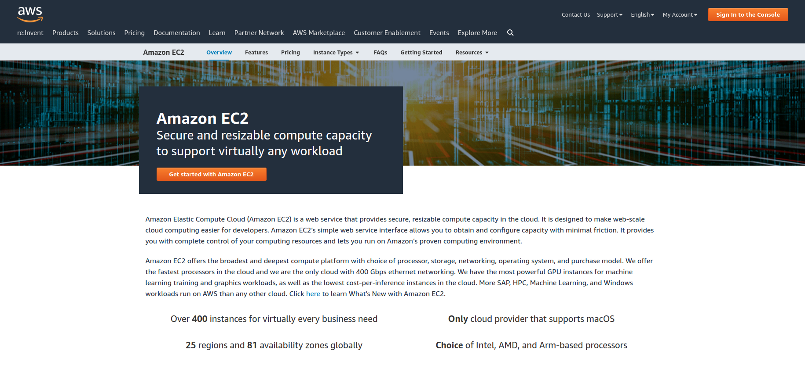
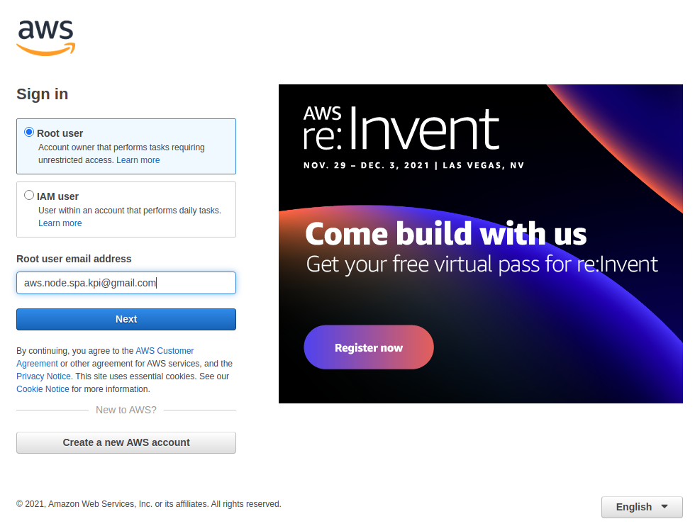
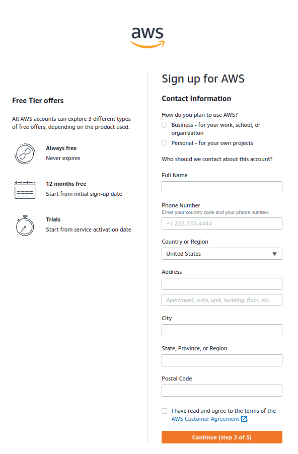
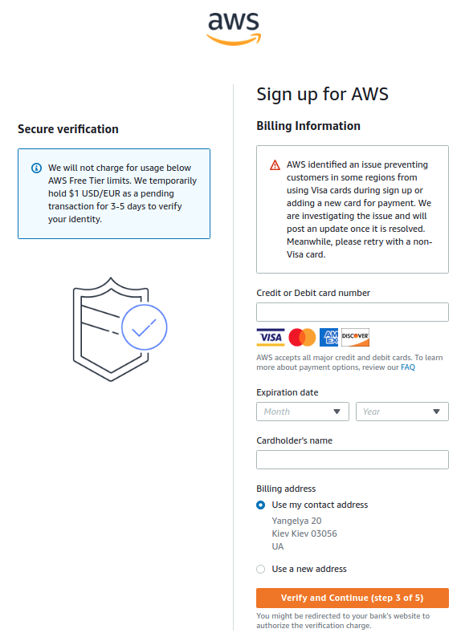
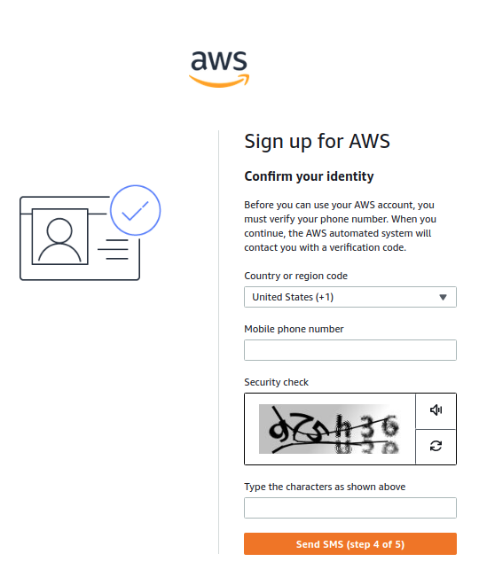
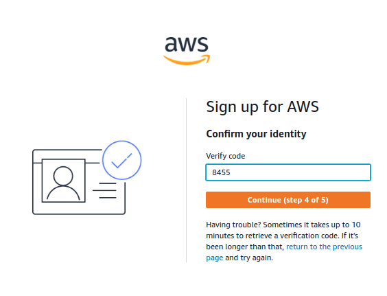
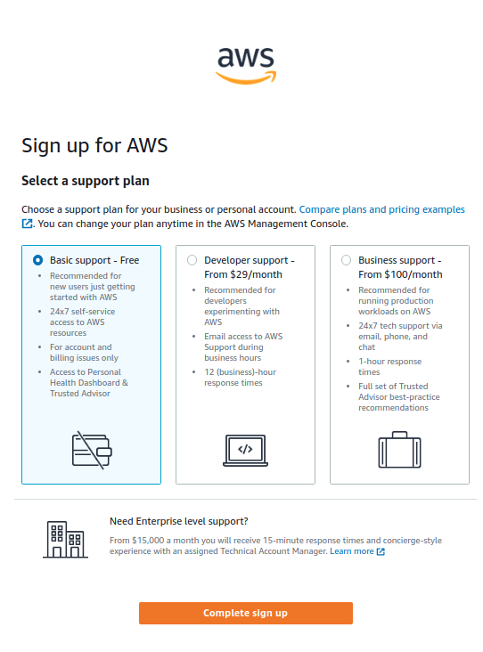
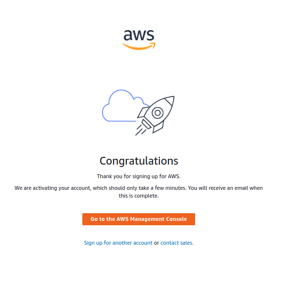
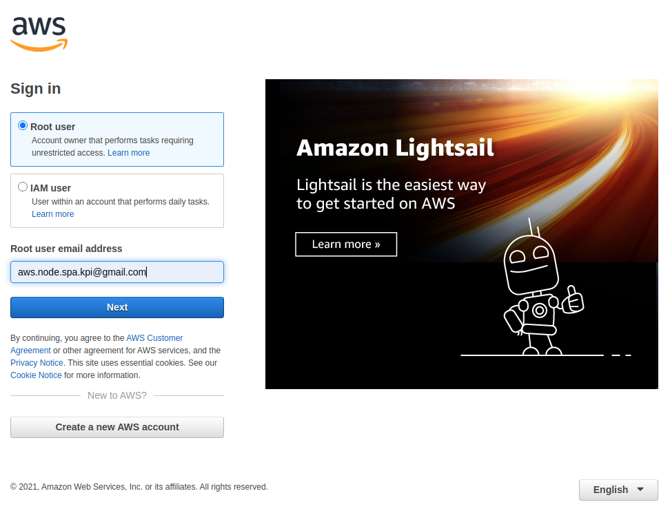

### Deploy Node.js & Vue.js SPA application to AWS

- Go to AWS EC2 (https://aws.amazon.com/ec2/)
- Click "Get started"

- Click "Create new AWS account"

- Complete steps 1-5 so create new account
- Step 1  

- Step 2  

- Step 3  

- Step 4  

- Step 5  

- Success!

- Log In to your account

- OK! We have access to our AWS Console

- Uploading our Docker image to DockerHub to use it in the future for AWS 
