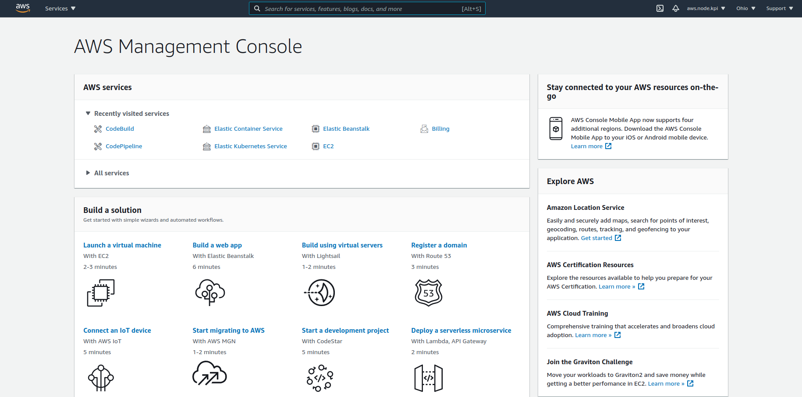
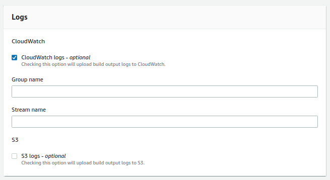

### Deploy Node.js & Vue.js SPA application to AWS

- Go to AWS EC2 (https://aws.amazon.com/ec2/)
- Click "Get started"


- Click "Create new AWS account"


- Complete steps 1-5 so create new account
- Step 1 </br>

- Step 2 </br>

- Step 3 </br>

- Step 4 </br>

- Step 5 </br>


- Success! </br>


- Log In to your account </br>


- OK! We have access to our AWS Console </br>


<br>

```
So, what will we use to automate our deployment process?
- Docker
To containerize our app to simplify deployment!
- CodePipeline (Continuous Integration/Continuous Deployment)
- CodeBuild
There we ill build our app image!
- Elastic Beanstalk
Immediately the service with which our application
will be available on the Internet, you can also use load balancers,
etc., we don't need it now.
```

- Let's go to Elastic Beanstalk and create our Application

- Click "Create a new application"


- Set App name and Description, and click "Create"


- Next, we need to create environment for that app


- We need "Web server environment"


- There we can create custom sub-domain


- Next, choose Docker platform


- Leave "Sample application" and click "Create environment"


- Our env will start creating, wait some minutes


- After successful initialization we can see next screen


- Next we need to create AWS Pipeline, return to main console page and choose CodePipeline


- Click "Create pipeline" and set Pipeline name


```
- Choose GitHub(Version 2)
- Connect to GitHub account with project
- Choose Repository and branch
- Click "Next"
```


```
- Build stage
- Choose "AWS CodeBuild", Region by default
- And then we need to create our CodeBuild, click "Create project"
- Browser will open pop-up to create it
```
- Set up name and description


- Choose next params for environment
- ! WARNING ! Select "Enable this flag..." we will need it to build our Docker image


- Use by default


- Leave as default


- We successfully created CodeBuild, continue with CodePipeline


- In the Deploy select "AWS Elastic Beanstalk"
- Select Application name and it's environment


- Click "Next" and "Create pipeline"
- We successfully created Pipeline, and it will start process of deployment
- Getting code from repository, build image, deploy to Elastic Beanstalk


- Oops... We have an error!


- Let's fix it! Click "Edit" at the top of pipeline
- Click "Edit stage" on the "Deploy"

- Click "Edit"
- Change "Input artifacts" - from "BuildArtifact" to "SourceArtifact"

- Save and click "Release change"
- Wait until it's done!

- Success! Our app deployed to AWS!


- Now we can access to it by link!
- Go to Console (Click on AWS logo, top left corner)
- Click "Elastic Beanstalk" -> Choose App -> Click the link under App name


- Our frontend client and API work good! [Application](http://appexample-env.eba-qdpfibgh.us-east-2.elasticbeanstalk.com/)


- Now we need to discuss a little, about Dockerfile
```
// Create our image from that version of node
FROM node:12-alpine

// Set our app directory to /app
WORKDIR /app

// Copy all files from current directory to app directory
COPY . .

// Run script to install all dependencies and build client
RUN ./scripts/deploy.sh

// Expose 5555 port, port which we defined in server.js
EXPOSE 5555

// Start our app by that command
CMD ["node", "server.js"]
```

- And about buildspec.yml
- That file can have a lot of different stages of deployment, but our is simple so, it's has two stages
```
version: 0.2

phases:
  pre_build:
    commands:
      - docker build -t spa-node-app .
  build:
    commands:
      - docker run -dp 5555:5555 spa-node-app

```

- In pre_build stage we create our app image using Dockerfile
- In build stage we run our image (Very important that our container port and exposed port are equal)
